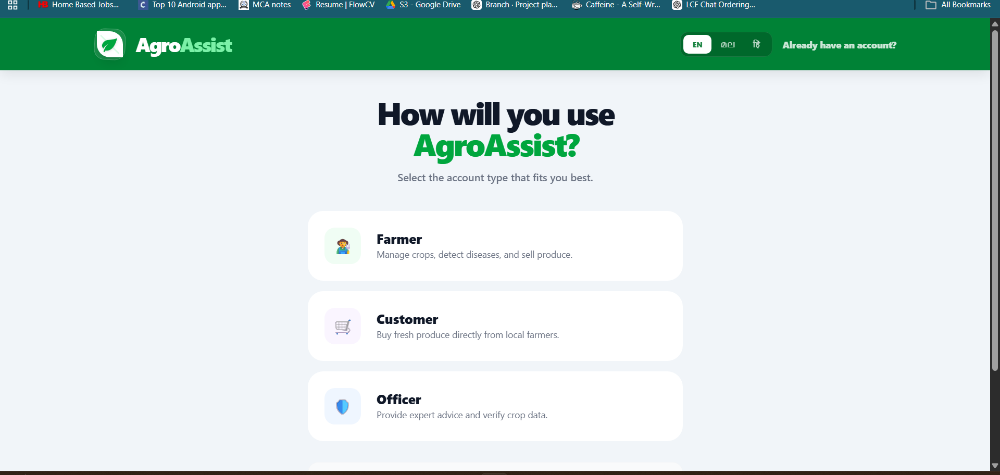
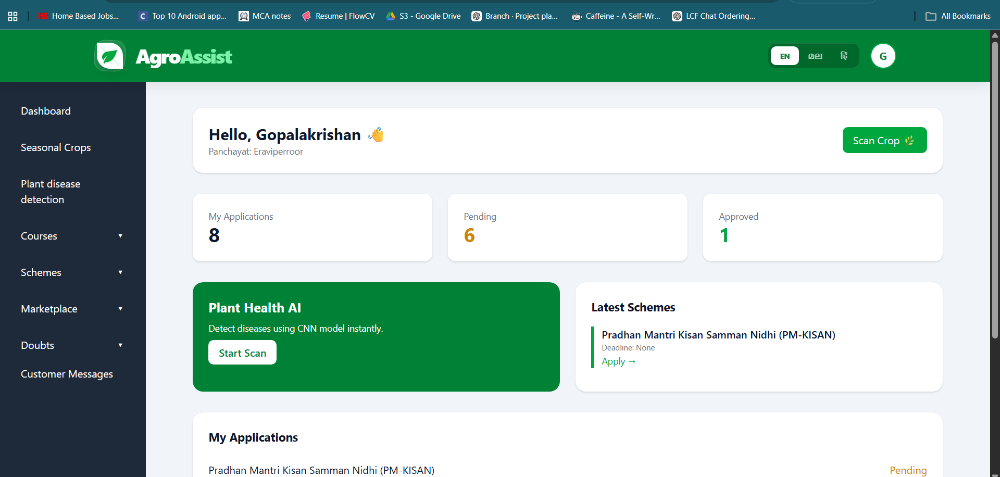
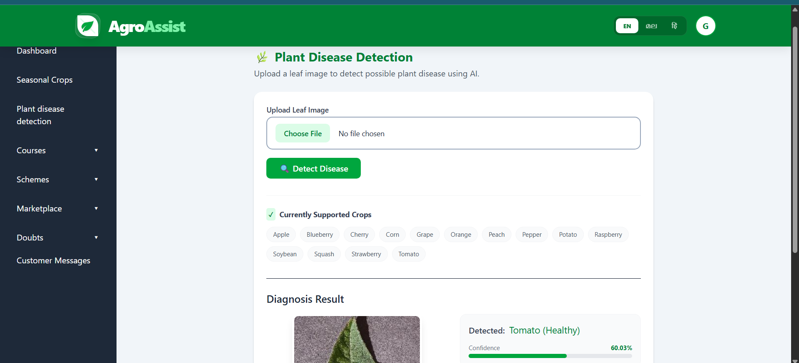

# 🌱 AgroAssist

## 📌 Overview

AgroAssist is a full-stack Django-based web application designed to support farmers, agricultural officers, and customers through a unified platform. It provides features like plant disease detection using machine learning, marketplace access, farmer–officer communication, and government scheme management.

---

## 🚀 Features

### 👨‍🌾 Farmer Module

* Register and login
* Upload plant images for disease detection
* View seasonal crops and recommendations
* Apply for government schemes
* Buy/Sell products in marketplace
* Ask doubts and chat with officers

### 🧑‍💼 Officer Module

* Approve farmer registrations
* Manage government schemes
* Add courses and lessons
* Respond to farmer queries
* Monitor applications

### 🛒 Marketplace

* Farmers can list products
* Customers can view and purchase items
* Manage listings (add/edit/delete)

### 🤖 Plant Disease Detection

* Upload plant images
* Predict disease using trained ML models
* Assist farmers with early diagnosis

### 💬 Communication System

* Real-time chat between farmers and officers
* Doubt management system

---

## 🛠 Tech Stack

* **Backend:** Python, Django
* **Frontend:** HTML, CSS, JavaScript
* **Database:** SQLite (development)
* **Machine Learning:** TensorFlow / Keras
* **Version Control:** Git & GitHub

---

## 📂 Project Structure

```id="pj9q2k"
AgroAssist/
│── accounts/
│── farmers/
│── officers/
│── marketplace/
│── crops/
│── doubts/
│── plant_disease/
│── templates/
│── static/
│── manage.py
```

---

## ⚙️ Setup Instructions

### 1️⃣ Clone the repository

```bash id="fw6c3z"
git clone https://github.com/gopika-box/AgroAssist.git
cd AgroAssist
```

### 2️⃣ Create virtual environment

```bash id="kz7kmt"
python -m venv venv
venv\Scripts\activate
```

### 3️⃣ Install dependencies

```bash id="j6p2v9"
pip install -r requirements.txt
```

### 4️⃣ Run migrations

```bash id="p0y6xn"
python manage.py migrate
```

### 5️⃣ Run server

```bash id="8o7slx"
python manage.py runserver
```

---

## 🤖 ML Model Setup

The trained machine learning models are included in the repository inside:

plant_disease/ml_models/

These models are used for plant disease prediction using deep learning.


## 📸 Screenshots

🏠 Landing Page


📝 Registeration




📊 Farmer Dashboard



🤖 Plant Disease Detection



## 🎯 Future Improvements

* Deploy to cloud (AWS/Render)
* Add real-time notifications
* Improve UI/UX
* Integrate more advanced ML models

---

## 👩‍💻 Author

**Gopika Vinu**

---

## ⭐ Acknowledgements

This project was developed as part of learning full-stack development and applying machine learning in agriculture.
